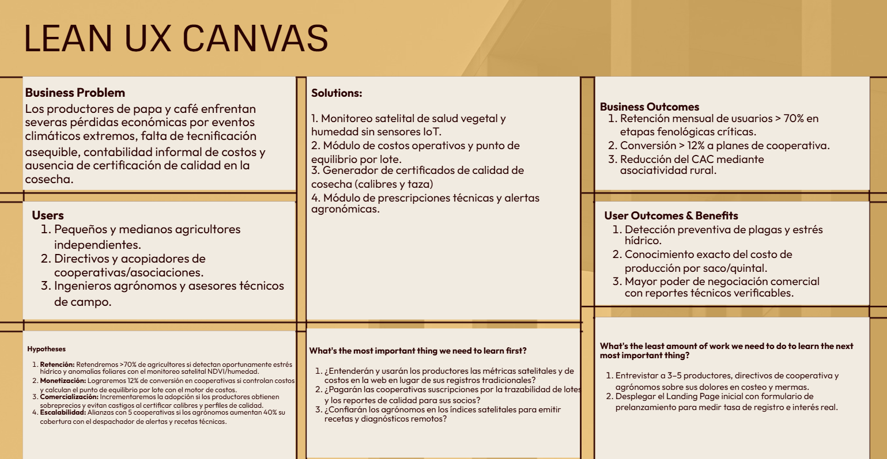

# Capítulo I: Introducción

## 1.1. Startup Profile
### 1.1.1. Descripción de la Startup
### 1.1.2. Perfiles de integrantes del equipo

## 1.2. Solution Profile
### 1.2.1 Antecedentes y problemática
El sector agrario en el Perú constituye un pilar fundamental para la seguridad alimentaria, el empleo rural y la economía de exportación. No obstante, la pequeña y mediana agricultura enfrenta una profunda brecha estructural caracterizada por la escasa tecnificación de campo, la alta vulnerabilidad a eventos meteorológicos extremos, la informalidad en la gestión de costos operativos y la falta de mecanismos digitales accesibles para certificar el valor cualitativo de la cosecha. Esta situación golpea con particular severidad a dos de las cadenas agroalimentarias más representativas del país: la papa (cultivo emblemático andino) y el café (primer producto agrícola de exportación).
Para sustentar la formulación del problema y la propuesta de valor, se aplica la técnica de análisis de las **5 W's y 2 H's** (*Who, What, Where, When, Why, How & How Much*):
* **Who (¿Quiénes son los afectados?):**
  La problemática impacta directamente a tres actores del ecosistema agrícola:
    1. **Pequeños y medianos agricultores independientes:** Conductores de parcelas de 1 a 10 hectáreas que dependen de la agricultura familiar de subsistencia y comercialización local.
    2. **Productores organizados y directivos de cooperativas/asociaciones:** Responsables de acopiar, estandarizar y comercializar la producción colectiva hacia mercados mayoristas y de exportación.
    3. **Ingenieros agrónomos y asesores técnicos de campo:** Profesionales responsables del diagnóstico fitosanitario y la prescripción agronómica en múltiples parcelas dispersas geográficamente.

* **What (¿Qué problema enfrentan?):**  
  Pérdidas económicas recurrentes, merma de rendimiento de cosechas y sobrecostos en insumos derivados de:
    1. La incapacidad de detectar a tiempo anomalías fisiológicas, deficiencias hídricas y plagas destructivas (como la roya amarilla en café o el gorgojo de los Andes en papa).
    2. El desconocimiento del costo real de producción por unidad de comercialización formal (quintal de café o tonelada de papa), lo que genera ventas por debajo del punto de equilibrio financiero.
    3. La falta de trazabilidad de origen y clasificación estandarizada (calibres en papa y perfiles de calidad/taza en café), impidiendo acceder a sobreprecios en nichos comerciales formales o de exportación.

* **Where (¿Dónde ocurre el problema?):**  
  En los principales valles y cuencas productoras del territorio peruano:
    1. **Cadena de papa:** Zonas altoandinas situadas entre los 2,500 y 4,000 m s.n.m. en departamentos como Junín, Huánuco, Puno, Cusco, Ayacucho y Cajamarca.
    2. **Cadena de café:** Valles de selva alta y ceja de selva en regiones como Cajamarca, Junín (Selva Central), San Martín, Amazonas y Cusco.

* **When (¿Cuándo se manifiesta el problema?):**  
  El problema se presenta a lo largo de todo el ciclo fenológico del cultivo y en la fase de liquidación comercial:
    - **Fase vegetativa y de floración/tuberización:** Durante la ocurrencia de eventos climáticos extremos como heladas meteorológicas y sequías estacionales (intensificadas de mayo a agosto en la sierra), así como en picos de calor y humedad que detonan plagas fúngicas.
    - **Fase de cosecha y poscosecha:** Al momento de negociar la producción con acopiadores e intermediarios informales, donde la ausencia de registros de costos y certificados de calidad obliga al productor a aceptar precios desfavorables.

* **Why (¿Por qué ocurre esta situación?):**
    - **Barreras económicas y de infraestructura:** Las soluciones convencionales de agricultura de precisión comercializadas en el país exigen la adquisición e instalación de sensores de humedad en tierra, estaciones meteorológicas locales y dispositivos IoT de alto costo, inaccesibles para el presupuesto del pequeño productor rural.
    - **Gestión empírica y cuadernos físicos:** La administración del fundo se efectúa de manera manual en cuadernos de apuntes o de forma memorística, imposibilitando consolidar jornales, combustible y agroquímicos en un costo unitario por lote.
    - **Falta de asistencia técnica continua:** Menos del 4% de las unidades productivas agropecuarias recibe asesoría técnica profesional continua, limitando la adopción de buenas prácticas de fertilización y manejo integrado de plagas.

* **How (¿Cómo impacta el problema en las operaciones diarias?):**  
  El deterioro ocurre de forma progresiva:
    1. El productor detecta el estrés hídrico o el ataque biológico de manera visual y tardía, cuando el daño en el follaje ya es irreversible y ha castigado el volumen de la cosecha.
    2. Para mitigar el daño, el productor aplica fertilizantes y plaguicidas de forma homogénea y reactiva a toda la parcela, disparando el gasto operativo y degradando la calidad del suelo.
    3. En la venta, entrega sacos sin discriminación verificable de calibres o puntaje de taza, siendo castigado por el comprador final con deducciones arbitrarias sobre el peso y calidad.

* **How Much (¿Cuánto representa cuantitativamente esta problemática?):**  
  La magnitud del problema se evidencia en los datos de las fuentes sectoriales oficiales del Perú:
    - **Extensión y dependencia climática de la papa:** En el Perú se registran más de 330,000 hectáreas sembradas anualmente de papa, de las cuales más del 90% se cultivan bajo régimen de secano (dependientes al 100% de lluvias) en zonas altoandinas, donde heladas y déficits hídricos generan mermas de hasta un 40% del rendimiento por hectárea ([MIDAGRI, 2023](https://www.gob.pe/midagri)).
    - **Impacto socioeconómico en la caficultura:** Más de 223,000 familias dependen del café distribuido en más de 380,000 hectáreas ([Junta Nacional del Café, 2022](https://juntadelcafe.org.pe/)). La proliferación de plagas por variaciones térmicas y la falta de trazabilidad hacia la Unión Europea y Norteamérica desvalorizan el grano, impidiendo capturar el diferencial de precios que ofrecen los cafés de especialidad.
    - **Brecha de tecnificación y asociatividad:** Según la Encuesta Nacional Agropecuaria (ENA), solo el 3.8% de los productores agropecuarios en el país recibe asistencia técnica especializada, apenas el 6.6% accede a programas de capacitación y el 93.3% no pertenece a ninguna organización agraria ([INEI, 2022](https://m.inei.gob.pe/prensa/noticias/334-de-los-productores-agropecuarios-del-pais-son-mujeres-14486/)), perpetuando la gestión informal y la venta a pérdida.

### 1.2.2. Lean UX Process

El enfoque Lean UX permite validar de manera temprana las soluciones propuestas centrándose en el valor real entregado a los usuarios y al negocio. Mediante este marco de trabajo ágil, el equipo explicita de forma transparente la visión del modelo de negocio, formula hipótesis comprobables y minimiza el riesgo tecnológico y financiero en la gestión de cultivos críticos como la papa y el café en el territorio peruano.

#### 1.2.2.1. Lean UX Problem Statements

The current state of the Peruvian agricultural domain—specifically within the potato and specialty coffee value chains—has focused mainly on small and medium independent farmers, organized cooperative leaders, and field agricultural advisors who face high crop loss due to climatic anomalies, empirical operational cost management, and lack of verifiable crop quality certification. What existing products/services fail to address is an accessible, software-only precision agriculture platform that eliminates the necessity for expensive on-field IoT hardware while integrating satellite crop monitoring, unit cost tracking, and standardized harvest scoring. Our product/service will address this gap by providing an accessible web platform with satellite vegetative analysis, lot-level cost calculation, and digital quality certification. Our initial focus will be small and medium independent producers and cooperative leaders in Andean and high-jungle agricultural valleys. We’ll know we are successful when we see sustained active lot registration by agricultural producers, a measurable reduction in reported seasonal crop losses, and widespread adoption of digital cost records during commercial.

#### 1.2.2.2. Lean UX Assumptions

En esta sección se declaran los supuestos fundamentales del equipo sobre los que se construye la propuesta de valor. Bajo el marco de trabajo Lean UX, estos supuestos identifican las áreas de mayor riesgo e incertidumbre del negocio, los usuarios y el producto, sirviendo como base para formular las hipótesis de validación.

##### Business Assumptions
Como equipo asumimos y sostenemos las siguientes premisas sobre el negocio:
* Existe una demanda insatisfecha por herramientas de agricultura digital accesibles en Perú que no requieran hardware IoT costoso.
* El modelo de suscripción freemium y B2B es financieramente viable mediante planes escalonados para cooperativas y asesores técnicos, manteniendo un nivel base gratuito para pequeños productores.
* Las cooperativas agrarias están dispuestas a pagar por software que estandarice la calidad del acopio y automatice la trazabilidad de sus socios.
* El valor agronómico de las alertas tempranas compensará la resistencia cultural inicial hacia la adopción tecnológica en zonas rurales.

##### Business Assumptions
Como equipo asumimos y sostenemos las siguientes premisas sobre el negocio:
* Existe una demanda insatisfecha por herramientas de agricultura digital accesibles en Perú que no requieran hardware IoT costoso.
* El modelo de suscripción freemium y B2B es financieramente viable mediante planes escalonados para cooperativas y asesores técnicos, manteniendo un nivel base gratuito para pequeños productores.
* Las cooperativas agrarias están dispuestas a pagar por software que estandarice la calidad del acopio y automatice la trazabilidad de sus socios.
* El valor agronómico de las alertas tempranas compensará la resistencia cultural inicial hacia la adopción tecnológica en zonas rurales.

##### Business Outcome Assumptions
Esperamos validar el éxito del negocio a través de los siguientes resultados medibles:
* Una tasa de retención mensual (MAU) superior al 70% durante las fases fenológicas críticas de siembra y cosecha.
* Una tasa de conversión mínima del 12% de cuentas gratuitas a planes de suscripción de cooperativas en los primeros 6 meses.
* El establecimiento de convenios o pruebas piloto con al menos 5 cooperativas de café y papa durante el primer año.
* La reducción del costo de adquisición de clientes (CAC) apalancando la captación grupal a través de asociaciones comunales.

##### User Assumptions
Reconocemos los siguientes supuestos sobre las condiciones y necesidades de nuestros usuarios:
* Los pequeños y medianos agricultores disponen de acceso recurrente a un teléfono móvil o navegador web (de forma directa o con apoyo de familiares y técnicos).
* Los directivos de cooperativas necesitan consolidar datos de múltiples parcelas para planificar cosechas y negociar mejores condiciones de venta mayorista.
* Los ingenieros agrónomos y asesores de campo precisan registrar diagnósticos y recetas técnicas de manera digital para optimizar sus visitas a parcelas dispersas.
* Los productores agrícolas perciben injusticia en las deducciones de precio que aplican los intermediarios debido a la falta de sustento técnico de calidad.

##### User Outcomes and Benefits Assumptions
Proyectamos que los usuarios obtendrán los siguientes beneficios tangibles al interactuar con la solución:
* Reducción de al menos un 25% en las pérdidas de cosecha gracias a la detección oportuna de estrés hídrico y anomalías en el follaje.
* Conocimiento exacto del costo real de producción por quintal o hectárea, evitando ventas por debajo del punto de equilibrio financiero.
* Disminución de más del 50% en el tiempo que las cooperativas invierten en consolidar manualmente los cuadernos de campo.
* Capacidad de los asesores técnicos para supervisar un 40% más de hectáreas mediante la visualización satelital centralizada.

##### Feature Assumptions
Planteamos que las siguientes capacidades del producto resolverán los problemas y necesidades identificados:
* **Satellite Health & Moisture Monitoring (Feature 1):** Un panel de índices de vegetación (NDVI) y humedad basado en satélites abiertos permitirá detectar anomalías sin sensores en tierra.
* **Lot-Level Cost Accounting Engine (Feature 2):** Un módulo de registro de gastos operativos calculará automáticamente el punto de equilibrio financiero por lote.
* **Digital Harvest Quality Scoring & Certificate (Feature 3):** Una herramienta de clasificación y emisión de certificados digitales de calidad (calibres de papa y perfiles de taza de café) respaldará mejores precios de venta.
* **Agronomic Prescription & Alert Dispatcher (Feature 4):** Un sistema de recomendaciones técnicas y alertas preventivas facilitará el seguimiento fitosanitario por parte de los asesores de campo.

#### 1.2.2.3. Lean UX Hypothesis Statements

* **Hypothesis Statement 1 (Satellite Health & Moisture Monitoring):**  
  We believe we will achieve an active monthly retention rate above 70% during peak growing cycles If small and medium independent farmers Attain early detection of vegetative anomalies and water stress without purchasing field hardware With our satellite-based vegetation and moisture index monitoring dashboard.

* **Hypothesis Statement 2 (Lot-Level Cost Accounting Engine):**  
  We believe we will achieve a 12% conversion rate to cooperative subscription plans If agricultural producers and cooperative managers Attain transparent unit-cost tracking and financial break-even calculation per harvested lot With an intuitive operational expense logging and automated reporting engine.

* **Hypothesis Statement 3 (Digital Harvest Quality Scoring & Certificate):**  
  We believe we will achieve accelerated user acquisition through word-of-mouth If organized farmers Attain higher commercial price realization and defense against unfair quality discounts With a verifiable digital quality scoring and certification generator for tuber calibers and coffee cup profiles.

* **Hypothesis Statement 4 (Agronomic Prescription & Alert Dispatcher):**  
  We believe we will achieve institutional partnerships with regional agricultural cooperatives If field agronomists Attain a 40% increase in monitored acreage and improved recommendation follow-up With a centralized agronomic alert dispatcher and digital prescription manager.

#### 1.2.2.4. Lean UX Canvas

A continuación, se presenta el Lean UX Canvas que consolida las decisiones estratégicas de negocio, usuarios, funcionalidades e hipótesis priorizadas para el desarrollo de la solución:

