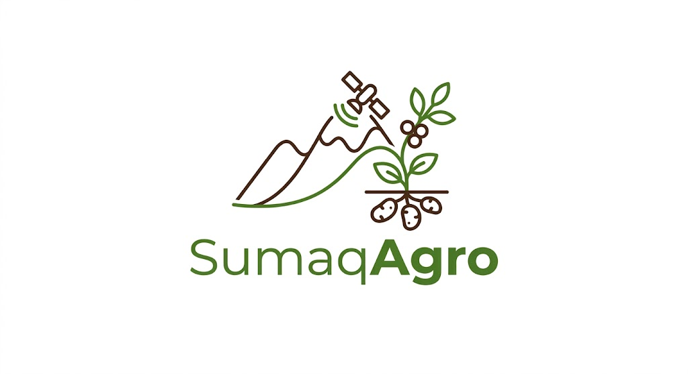
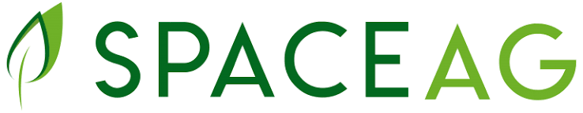
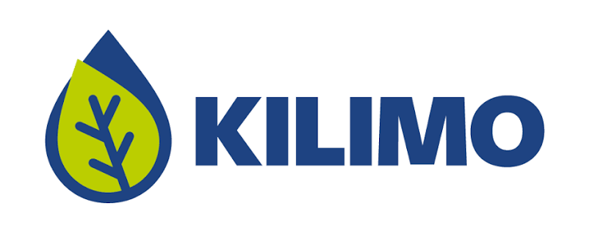
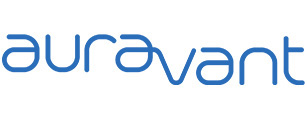

# Capítulo II: Requirements Elicitation & Analysis

En el presente capítulo, el equipo se dedica a investigar y comprender a fondo el contexto operativo y las carencias del sector agroalimentario antes de iniciar el desarrollo tecnológico. Más allá de definir un listado de características del software, aplicamos un riguroso proceso de educción y análisis de requisitos. Esta fase es fundamental para comprobar empíricamente que las problemáticas que SumaqAgro pretende solucionar tienen un impacto genuino en la rentabilidad y gestión diaria de los agricultores y cooperativas peruanas.

## 2.1. Competidores
### 2.1.1. Análisis competitivo

Para asegurar una captura de datos estructurada y de alto valor, se han elaborado guías de indagación personalizadas para cada uno de nuestros segmentos de mercado. Estos instrumentos de investigación están diseñados para descubrir no solo el perfil demográfico, sino también el nivel de madurez digital y los cuellos de botella que enfrentan los usuarios en la actualidad. Previo a la presentación de estas entrevistas, detallamos el panorama competitivo (Landscape) que valida la viabilidad y diferenciación estratégica de SumaqAgro en el ecosistema AgTech.

<table border="1" cellpadding="10" cellspacing="0" style="margin-left: auto; margin-right: auto; font-family: sans-serif; width: 100%;">
  <tr>
    <th colspan="6" style="text-align: center; font-size: 1.2em;">Competitive Analysis Landscape</th>
  </tr>
  <tr>
    <td colspan="2" rowspan="2" style="width: 20%;"><b>¿Por qué llevar a cabo este análisis?</b></td>
    <td colspan="4">¿Cómo se posiciona SumaqAgro frente a sus competidores en cuanto a propuesta de valor, marketing, producto y estrategia?</td>
  </tr>
  <tr>
    <td colspan="4">Es un análisis comparativo que permite identificar fortalezas, debilidades, oportunidades y amenazas, así como entender mejor la posición del producto frente a otros actores relevantes del mercado agrotecnológico.</td>
  </tr>
  <tr>
    <td colspan="2" style="text-align: center;"><b>Competidores</b></td>
    <td style="text-align: center; vertical-align: middle; width: 20%;">
      <b style="display: block; margin-bottom: 6px;">SumaqAgro</b>
      
    </td>
    <td style="text-align: center; vertical-align: middle; width: 20%;">
      <b style="display: block; margin-bottom: 6px;">SpaceAG</b>
      
    </td>
    <td style="text-align: center; vertical-align: middle; width: 20%;">
      <b style="display: block; margin-bottom: 6px;">Kilimo</b>
      
    </td>
    <td style="text-align: center; vertical-align: middle; width: 20%;">
      <b style="display: block; margin-bottom: 6px;">Auravant</b>
      
    </td>
  </tr>
  <tr>
    <td rowspan="2" style="writing-mode: vertical-lr; transform: rotate(180deg); text-align: center; font-weight: bold;">Perfil</td>
    <td><b>Overview</b></td>
    <td>Plataforma Web (Software-only Precision Ag) enfocada en gestión agrícola, monitoreo y calidad digital.</td>
    <td>Solución de Drone & Satellite Analytics centrada en el análisis avanzado de rendimiento.</td>
    <td>Plataforma SaaS de Water Management especializada en la gestión y ahorro de agua.</td>
    <td>Digital Agronomy Ecosystem altamente modular y configurable para agricultura de precisión.</td>
  </tr>
  <tr>
    <td><b>Ventaja competitiva</b></td>
    <td>Monitoreo satelital (NDVI/humedad) libre de sensores físicos en campo, integrando cálculo de costos unitarios y certificación digital de calidad.</td>
    <td>Monitoreo premium de ultra alta resolución (imágenes satelitales + ortofotos por drones) con inteligencia artificial.</td>
    <td>Algoritmos propietarios de balance hídrico que calculan evapotranspiración y monetizan el ahorro de agua.</td>
    <td>Ecosistema abierto con soporte para múltiples capas de información, maquinaria e integraciones de terceros.</td>
  </tr>
  <tr>
    <td rowspan="2" style="writing-mode: vertical-lr; transform: rotate(180deg); text-align: center; font-weight: bold;">Perfil de Marketing</td>
    <td><b>Mercado objetivo</b></td>
    <td>Pequeños/medianos agricultores (papa/café), cooperativas y asesores técnicos independientes en Perú.</td>
    <td>Medianas y grandes corporaciones agroexportadoras de alto valor (arándanos, uva) en la costa peruana.</td>
    <td>Productores medianos/grandes con sistemas de riego tecnificado en regiones con estrés hídrico.</td>
    <td>Empresas agropecuarias de escala extensiva, asesores agronómicos y distribuidores de agroquímicos.</td>
  </tr>
  <tr>
    <td><b>Estrategias de marketing</b></td>
    <td>Penetración B2B2C mediante cooperativas, modelo freemium accesible y alianzas con ONGs de desarrollo rural.</td>
    <td>Ventas B2B corporativas, demostraciones piloto en fundos industriales y presencia en congresos exportadores.</td>
    <td>Programas ESG, marketing de contenidos sobre huella hídrica y alianzas con corporaciones globales.</td>
    <td>Autoservicio SaaS, seminarios web técnicos, certificaciones gratuitas y convenios con marcas de maquinaria.</td>
  </tr>
  <tr>
    <td rowspan="3" style="writing-mode: vertical-lr; transform: rotate(180deg); text-align: center; font-weight: bold;">Perfil de Producto</td>
    <td><b>Productos & Servicios</b></td>
    <td>
      <ul style="margin: 0; padding-left: 15px;">
        <li>Índices NDVI/humedad satelital</li>
        <li>Motor de costos por lote</li>
        <li>Certificados de calidad digital</li>
      </ul>
    </td>
    <td>
      <ul style="margin: 0; padding-left: 15px;">
        <li>Vuelos programados con drones</li>
        <li>Conteo de plantas con IA</li>
        <li>Gestión de personal de cosecha</li>
      </ul>
    </td>
    <td>
      <ul style="margin: 0; padding-left: 15px;">
        <li>Recomendaciones de riego</li>
        <li>Auditoría de ahorro de agua</li>
        <li>Reporte de huella hídrica</li>
      </ul>
    </td>
    <td>
      <ul style="margin: 0; padding-left: 15px;">
        <li>Prescripción variable</li>
        <li>Integración con maquinaria</li>
        <li>Monitoreo satelital multibanda</li>
      </ul>
    </td>
  </tr>
  <tr>
    <td><b>Precios & Costos</b></td>
    <td>Modelo Freemium: Nivel gratuito para pequeños productores y planes escalonados para cooperativas.</td>
    <td>Contratos Enterprise de alto costo (miles de dólares), inaccesibles para el pequeño productor familiar.</td>
    <td>SaaS por hectárea. Requiere riego tecnificado para justificar el retorno de inversión.</td>
    <td>Planes Freemium limitados con saltos agresivos a tiers Premium corporativos por volumen.</td>
  </tr>
  <tr>
    <td><b>Canales de distribución</b></td>
    <td>Plataforma Web responsiva (Angular) optimizada para conexiones móviles 3G/4G rurales.</td>
    <td>App Web de escritorio y Aplicación Móvil nativa para hardware de gama alta.</td>
    <td>App Web y App Móvil de consulta rápida en campo para operarios de riego.</td>
    <td>Plataforma Web integral y Aplicación Móvil multiplataforma para registro de muestras.</td>
  </tr>
  <tr>
    <td rowspan="5" style="writing-mode: vertical-lr; transform: rotate(180deg); text-align: center; font-weight: bold;">Análisis SWOT</td>
  </tr>
  <tr>
    <td><b>Fortalezas</b></td>
    <td>
      <ul style="margin: 0; padding-left: 15px;">
        <li>Sin hardware (100% software).</li>
        <li>Integra analítica, costos y calidad.</li>
        <li>Especialización en papa andina y café.</li>
      </ul>
    </td>
    <td>
      <ul style="margin: 0; padding-left: 15px;">
        <li>Alta resolución con drones.</li>
        <li>Liderazgo en sector exportador costero.</li>
        <li>Fuerza de ventas B2B corporativa.</li>
      </ul>
    </td>
    <td>
      <ul style="margin: 0; padding-left: 15px;">
        <li>Monetización por bonos de carbono.</li>
        <li>Plataforma técnica muy madura.</li>
        <li>Especialización total en recurso hídrico.</li>
      </ul>
    </td>
    <td>
      <ul style="margin: 0; padding-left: 15px;">
        <li>Alta escalabilidad internacional.</li>
        <li>Ecosistema modular mediante Add-ons.</li>
        <li>Robusta integración con hardware/tractores.</li>
      </ul>
    </td>
  </tr>
  <tr>
    <td><b>Debilidades</b></td>
    <td>
      <ul style="margin: 0; padding-left: 15px;">
        <li>Startup nueva en el mercado.</li>
        <li>Dependencia de APIs satelitales externas.</li>
        <li>Ausencia de app móvil nativa (Sprint 1).</li>
      </ul>
    </td>
    <td>
      <ul style="margin: 0; padding-left: 15px;">
        <li>Costos insostenibles para la pequeña escala.</li>
        <li>Ausencia de control financiero/costos.</li>
        <li>Rigidez operativa en sierra/selva.</li>
      </ul>
    </td>
    <td>
      <ul style="margin: 0; padding-left: 15px;">
        <li>Inútil en agricultura de secano (sin riego).</li>
        <li>Ignora el factor fitosanitario/plagas.</li>
        <li>Precios prohibitivos para minifundios.</li>
      </ul>
    </td>
    <td>
      <ul style="margin: 0; padding-left: 15px;">
        <li>Curva de aprendizaje compleja/técnica.</li>
        <li>Baja adecuación a micro-parcelas.</li>
        <li>Sin contabilidad financiera de costos.</li>
      </ul>
    </td>
  </tr>
  <tr>
    <td><b>Oportunidades</b></td>
    <td>
      <ul style="margin: 0; padding-left: 15px;">
        <li>96% de productores sin asistencia formal.</li>
        <li>Normativa de trazabilidad de la UE.</li>
        <li>Creciente conectividad rural.</li>
      </ul>
    </td>
    <td>
      <ul style="margin: 0; padding-left: 15px;">
        <li>Venta de big data a aseguradoras.</li>
        <li>Expansión a corporaciones regionales.</li>
        <li>Integración con robótica agrícola.</li>
      </ul>
    </td>
    <td>
      <ul style="margin: 0; padding-left: 15px;">
        <li>Crisis climática y escasez de agua.</li>
        <li>Financiamiento ESG corporativo.</li>
        <li>Nuevos bonos de sostenibilidad global.</li>
      </ul>
    </td>
    <td>
      <ul style="margin: 0; padding-left: 15px;">
        <li>Socio técnico de marcas de tractores.</li>
        <li>Alineamiento con catastro público.</li>
        <li>Modelo "marca blanca" para agrónomos.</li>
      </ul>
    </td>
  </tr>
  <tr>
    <td><b>Amenazas</b></td>
    <td>
      <ul style="margin: 0; padding-left: 15px;">
        <li>Fuerte resistencia al cambio digital.</li>
        <li>Extrema nubosidad en la sierra que limite visión de satélites.</li>
        <li>Clonación de modelo por empresas grandes.</li>
      </ul>
    </td>
    <td>
      <ul style="margin: 0; padding-left: 15px;">
        <li>Crisis de precios en la agroexportación.</li>
        <li>Regulaciones estrictas de vuelo de drones.</li>
        <li>Saturación del mercado corporativo.</li>
      </ul>
    </td>
    <td>
      <ul style="margin: 0; padding-left: 15px;">
        <li>Precipitaciones excesivas temporales.</li>
        <li>Sensores físicos IoT a precios de dumping.</li>
        <li>Caída en cotización de bonos hídricos.</li>
      </ul>
    </td>
    <td>
      <ul style="margin: 0; padding-left: 15px;">
        <li>Competencia de gigantes (Bayer FieldView).</li>
        <li>Interrupciones en constelaciones satelitales gratuitas.</li>
      </ul>
    </td>
  </tr>
</table>

### 2.1.2. Estrategias y tácticas frente a competidores

## 2.2. Entrevistas
### 2.2.1. Diseño de entrevistas
### 2.2.2. Registro de entrevistas
### 2.2.3. Análisis de entrevistas

## 2.3. Needfinding
### 2.3.1. User Personas
### 2.3.2. User Task Matrix
### 2.3.3. User Journey Mapping
### 2.3.4. Empathy Mapping

## 2.4. Big Picture Event Storming

## 2.5. Ubiquitous Language